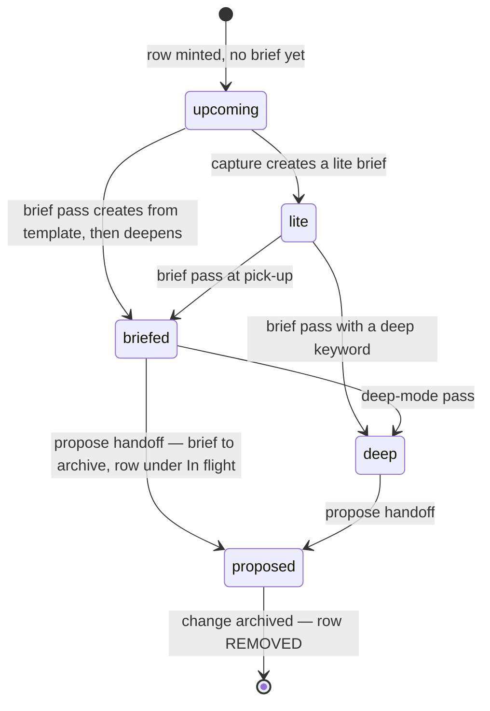

# The backlog module

`openspec-backlog` adds the layer OpenSpec deliberately doesn't have: an ordered ledger of
what to build next, a mutable working brief per item, and an autonomous runner that walks one
item through the whole lifecycle. Three commands: `/opsx:backlog` (capture), `/opsx:brief`
(deepen), `/opsx:next` (run).

This page teaches the model. The operational rules **govern from inside your project** at
`openspec/backlog/README.md` ([scaffold source](../modules/openspec-backlog/scaffold/backlog/README.md))
— agents read that file, not this one. If this page and that file ever disagree, that file wins.

## Ledger discipline: order vs status

The whole module rests on one split of ownership:

- **The ledger owns order.** `openspec/backlog/backlog.md` is the ONLY authority for what to
  build next. Roadmaps, PRDs, audit reports, anything with "phases" — all of it is *scope
  input*: read it for what a change must do, never for what order to do things.
- **OpenSpec owns status.** `openspec list` = in flight; `openspec/changes/archive/` = done.
  The ledger never restates either. Nothing is ever hand-marked "done" — there is nowhere to
  write it. If ledger and OpenSpec disagree, OpenSpec wins; fix the ledger.

Two consequences shape everything else:

- **The pointer is the status.** Each row is `| Item | Depends on | Pointer / state |`. The
  pointer target tells you where the item is in its life — there is no status column to drift
  out of date, and a row's disappearance is its "done".
- **The ledger points, never copies.** Deep context lives in the item's brief until propose,
  then in the change. A pointer cell carries a target, a bold state label, and at most a short
  note.

Rows live in two sections: `## In flight` (a real change exists) and `## Upcoming` (everything
else, in development order). Planning passes — `/opsx:backlog` reordering, splitting, merging —
act on Upcoming only. **In flight rows are never reordered, merged, or split**; they change
only as their change advances.

## The pointer-state lifecycle

(Capture = `/opsx:backlog`; brief pass = `/opsx:brief`; the propose handoff happens in stock
`/opsx:propose` — guided by the installed config context — or in `/opsx:next`.)

| State | Pointer cell reads | Set by |
|---|---|---|
| upcoming | `—` | a hand-added row, or a capture-sweep row awaiting a brief |
| lite | `briefs/<name>.md` (**lite**) | `/opsx:backlog` |
| briefed / deep | `briefs/<name>.md` (**briefed** / **deep**) | `/opsx:brief` |
| proposed (in flight) | `openspec/changes/<name>/`, row under `## In flight` | the propose handoff |
| done | *row removed* | the archive step |

The item's identity is its kebab-case name — the name of its (future)
`openspec/changes/<name>/` directory. `Depends on` takes bare names for hard dependencies
(satisfied when the dep has no row and a matching archive entry exists) and `soft:` prefixes
for sequencing preferences. When `## Upcoming` outgrows one readable list, the README documents
an optional **waves** pattern (grouping by scheduling semantics, not topic).

## Working briefs

A brief is the mutable thinking home for ONE upcoming item — its intended outcome, objective,
shape, requirements, risks, pointers. One file per item, `briefs/<name>.md`, created from
[`templates/brief.md`](../modules/openspec-backlog/scaffold/backlog/templates/brief.md).

1. **Lite** — `/opsx:backlog` captures only what the input honestly supports, marked
   `> **Preliminary capture — deepen with /opsx:brief before propose.**` Open questions stay
   open questions; a thin honest brief beats a padded one. Each brief also records, in
   `## Intended outcome`, the item's slice of the user's ideal end-state — the waypoint on the
   0→1 path that `/opsx:backlog` sketches from a light research pass, kept alive per-item so
   depth is judged against where the work is headed, not the item in isolation.
2. **Deepened** — `/opsx:brief <name>` enriches the brief in place at pick-up time,
   codebase-grounded and refined through conversation. Deep keywords (`deep`,
   `best practices`, `deep research`) add the **Architecture & Ecosystem** section via web
   research. Deepening earlier than pick-up is waste — the brief would rot.
3. **Handed off** — at propose (stock `/opsx:propose` or `/opsx:next`), the brief is the
   PRIMARY input for `proposal.md` and `design.md`. Then the file MOVES to
   `openspec/backlog/archive/` and the row repoints to the change. Archived, not deleted — an
   active copy would be stale: the thinking now lives in the change's artifacts, which
   supersede the brief entirely.

## The capture sweep

Implementation always discovers work it does not build. During apply — stock `/opsx:apply` or
the apply step of `/opsx:next` — those discoveries are harvested back into the backlog before
committing: deferred/out-of-scope statements in the change's artifacts, caveats in `tasks.md`,
deferral comments in code. Dedup first (archive, `openspec list`, existing rows — always all
three), then per discovery: enrich an existing item's brief, add a row + lite brief, or —
when it's not obvious — surface it with a recommendation instead of acting silently. The sweep
is **additive only**: never reorder, merge, or delete rows during apply; reordering is
planning's job. The full contract lives in
[the backlog README](../modules/openspec-backlog/scaffold/backlog/README.md).

This is what makes the loop self-feeding: apply produces the raw material that
`/opsx:backlog` and the sweep turn into the next items.

## The worklog protocol

### The problem: compaction wipes the plan

Long-running loops — especially in ~250k-context harnesses like Codex — compact the
orchestrator mid-change. Everything that lived only in context is wiped: the plan, progress
inside a big task, and every subagent's findings. The agent then restarts the big task from
scratch, cycling forever without finishing. Run `/loop /opsx:next` or a `/goal` objective
overnight and this is not an edge case — it is the expected failure mode of any state that
lives only in context.

### The fix: durable, in-change memory

`openspec/changes/<name>/worklog.md` — created from `openspec/backlog/templates/worklog.md` at
the propose handoff (or on the first apply touch if absent). It lives **inside the change
directory**, so it archives with the change; no cleanup protocol needed.

Two sections, two disciplines:

- `## State` — REWRITTEN in place on every update; hard cap ~30 lines. Fields:
  - `Now:` — the task in progress
  - `Next:` — the next concrete action
  - `Decisions:` — calls made and why, one line each
  - `Do NOT redo:` — dead ends: "tried X, failed because Y"
  - `Environment:` — quirks discovered: "tests need Z running"
- `## Entries` — append-only, terse one-liners, chronological.

State is the 30-second re-orientation read; Entries are the evidence trail.

### The five rules

Embedded in the template itself as comments, in the backlog README, in the `/opsx:next` body,
and — via the installed config snippet — in stock apply's runtime instructions, so a freshly
compacted agent meets them on every path:

1. **Read before work.** Every apply session STARTS by reading `## State` and scanning
   `Do NOT redo`. Re-orientation is the default entry path, not a recovery mode — no
   compaction detection needed.
2. **Write ahead.** Update `Now:` BEFORE starting a task; append the entry AFTER finishing it.
   A wipe at any instant leaves a fresh trail.
3. **Subagent digest (CRITICAL).** A subagent's result exists only in orchestrator context.
   The INSTANT a subagent returns, append its digest — finding, file paths, verdict, what NOT
   to redo — BEFORE acting on the result. Never batch digests for later; later may not exist.
4. **Trust the log over instinct.** Before starting any task, check Entries and `Do NOT redo`
   for evidence it already happened; verify on disk (committed code, passing tests, ticked
   boxes), then skip. When the log says done and the disk agrees, it is done.
5. **Record dead ends the moment they fail.** "Tried X — failed because Y" is the single line
   that breaks the endless retry cycle.

### Big tasks: decompose in the worklog

A task too large to finish comfortably inside one context window is decomposed IN THE WORKLOG:
append a `### Plan: <task>` entry with numbered sub-steps and tick each as it completes.
`tasks.md` keeps the change's granularity; the worklog carries the finer grain, so progress
*within* the task survives compaction. Do not inflate `tasks.md` to compensate — that file
belongs to the change's shape, not to one session's memory.

### Why there is no compaction detection

Detection would need the agent to notice its own memory loss — the one thing a compacted agent
cannot do reliably. The protocol sidesteps it: rule 1 makes reading `## State` the default
entry path for *every* session, and rule 2 guarantees the file is current at any instant a
wipe could land. A freshly compacted agent and a brand-new agent walk the exact same path and
arrive at the same picture. Nothing needs to know that compaction happened.

## /opsx:next: bounded autonomy

`/opsx:next` processes exactly **one** item per invocation, end-to-end. Two loops — don't
confuse them: the **outer loop** is your harness's loop driver stepping through ledger rows —
`/loop /opsx:next`, or `/goal` with an objective that repeats `/opsx:next` until it reports
`LOOP STOP`; the
**inner loop** is apply working through a change's tasks list (that one already lives in the
stock apply flow). The command *composes* the sibling and stock flows — `/opsx:brief`, then
stock `/opsx:propose` → `/opsx:apply` → `/opsx:sync` → `/opsx:archive` — and stock behavior
stays authoritative except for three autonomy overrides: names are always passed explicitly
(no selection prompts), the brief is written without offering, and sync always runs before
archive.

The ledger alone picks the item: an In flight row resumes wherever its change state implies;
otherwise the topmost Upcoming row whose dependencies are satisfied. The pointer state decides
the entry stage, and the item flows through all remaining stages in the one invocation.

### Hard stops

`/opsx:next` never pushes through ambiguity. Each of these ends the run with
`LOOP STOP: <reason>`:

- verification-gate failure
- an apply blocker: unclear task, error, or implementation revealing a design issue
- an ambiguous capture-sweep finding — surfaced with a recommendation, never resolved silently
- a dependency cycle, or no eligible row
- ledger ↔ OpenSpec disagreement (OpenSpec wins; the ledger is fixed only when the fix is
  unambiguous)
- a depth mismatch or unresolved depth boundary (when the
  [delivery-depth pillar](pillars.md#the-delivery-depth-pillar) is installed)

### The LOOP protocol

Every invocation — including a stop before any work — ends with an iteration report whose last
line is `LOOP CONTINUE` or `LOOP STOP: <reason>`. `LOOP CONTINUE` is printed only when the
item archived cleanly AND another eligible row remains; every other case is a stop with its
reason. That contract is what makes `/loop /opsx:next` — or a `/goal` run driving it — safe
to leave running: the loop needs no supervisor, because every failure path halts it with a
reason attached.

One phrasing tripwire for `/goal`: state the objective as *"run `/opsx:next` repeatedly until
it reports `LOOP STOP`"* — delegate the process to the command. An objective that respecifies
the pipeline itself ("brief everything, then propose each, use subagent teams") invites the
orchestrator to fan items out in parallel, which violates the concurrency contract (see the
scaffold README): bulk work is the one-item cycle repeated, hard deps gate on *archived*, and
the ledger is single-writer. Parallel subagents belong inside a stage — research, briefing
different upcoming items, tests — never across items' propose/apply.

### The verification gate

Before sync and archive, `/opsx:next` runs the command(s) listed in the `## Verification`
section of `openspec/backlog/README.md` — the owner writes them (e.g. `npm test`).

- Section missing or empty → warn in the report and treat as pass. **Fill it in before you
  loop** — an empty gate means changes archive on the agent's own say-so.
- Any command fails → hard stop. A change is never archived over a red verification.
